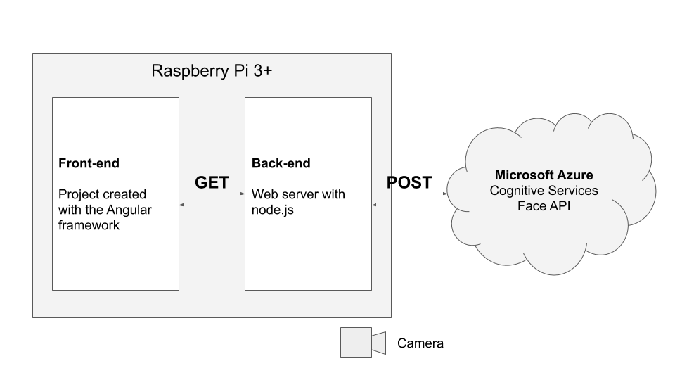
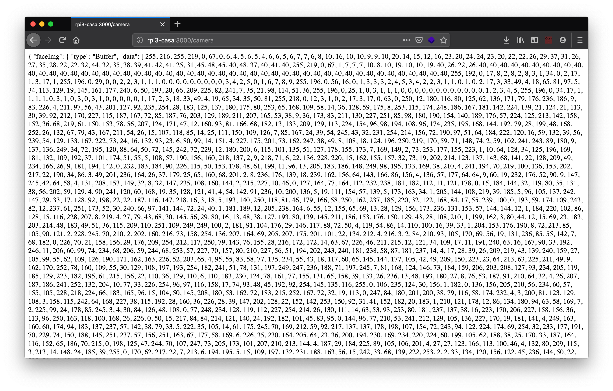

# Architecture
We used a client-server approach for this project, to easily test the code, to share tasks among the team and to support future improvements.

<p align="center">

</p>

## Back-end
We used Node.js as language for the back-end because JavaScript is a language already studied by the students of the forth year and for similiarity with the front-end.

We used:
- [express](https://expressjs.com/) for the web server
- [pi-camera-connect](https://github.com/servall/pi-camera-connect) to read pictures from the Raspberry camera

## Front-end
We used Angular to develop the front-end. This is beyond the common knowledge of students of the forth year, but since there are several parts of the UI that are repeated, we thought that the effort of studying and using a new tool based on the concept of "components" paid off.

## Microsoft Azure Cloud Services

We used the [Microsoft Azure Cognitive Services](https://azure.microsoft.com/en-us/services/cognitive-services) to analyze and recognize the emotions in the picture. 

We didn't make a comparative benchmark with other similiar services, but we found the service well documented and with a good accuracy. Overall we are very satisfied with it.

# Getting Started

## Back-end
What you need:
- Rasberry PI, tested on 3 and 3+
- Camera, tested with original camera v2.1

First of all, connect to the Raspberry via SSH or keyboard and mouse and open a Terminal.

### Install Node.js
To install node.js, go to the [download page](https://nodejs.org/it/download/) and select ARMv7:

```sh
# Last stable version at 2019-05-27
https://nodejs.org/dist/v10.15.3/node-v10.15.3-linux-armv7l.tar.xz
tar -xzf node-v10.15.3-linux-armv7l.tar.xz
cd node-v10.15.3-linux-armv7l
sudo cp -R * /usr/local/
```

Then test that everything is OK:

```sh
node -v
npm -v
```

If this doesn't work... please submit an issue!

### Download this repository
Just download this repo:

```sh
git clone http://github.com/marconicivitavecchia/microsoft-ai.git
```

### Configure environment
Before running the server, we need to add Azure key that cannot be shared in GitHub.

Navigate to the server folder and create the .env file:
```sh
cd microsoft-ai/code/server
touch .env
```

Edit the file with `nano`, `vim` or whatever and add the following line, with an API Key:
```
API_KEY='your-azure-api-key'
```


### Run the server
Navigate into the server folder and run the server:

```sh
cd microsoft-ai/code/server
# Install dependencies
npm install
# Run the server
node main.js
```

Now with any browser, open a new tab and go to the url `/camera`:
<p align="center">

</p>


## Front-end
### Install Node.js 
We need to install node and npm also in the front-end. If you are using the same Raspberry also for the front-end, we don't have to do anything now.

If you are using another machine for development, you have to install `node` also in this machine. On mac, we suggest to install node via `brew install node`. On other systems, please go to the official [download page](https://nodejs.org/it/download/).

### Install Angular
Install the Angular framework:

```sh
npm install -g @angular/cli
```

### Download this repository
Again, if you are using the same Raspberry, you don't have to download the repository twice. Otherwise, in the development machine, use the same command as above:

```sh
git clone http://github.com/marconicivitavecchia/microsoft-ai.git
```
### Run the front-end
Go to the front-end folder and run it:

```sh
cd microsoft-ai/code/hello-frog
ng serve --open
```


