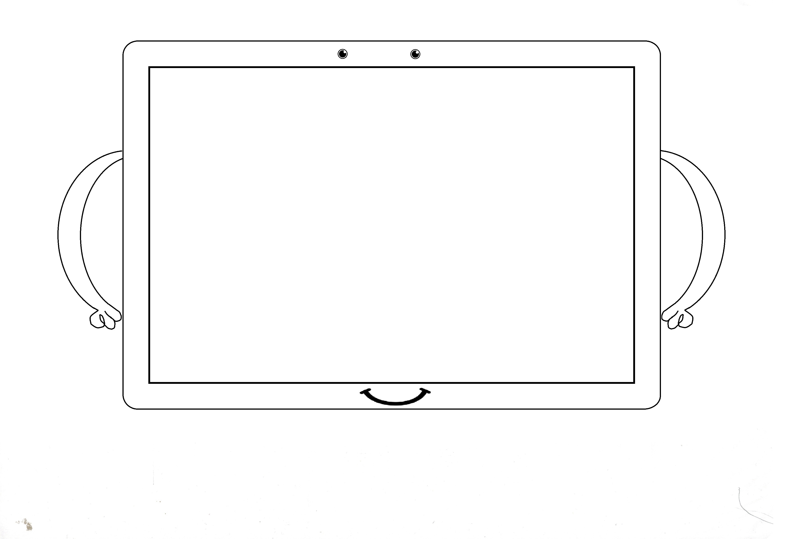
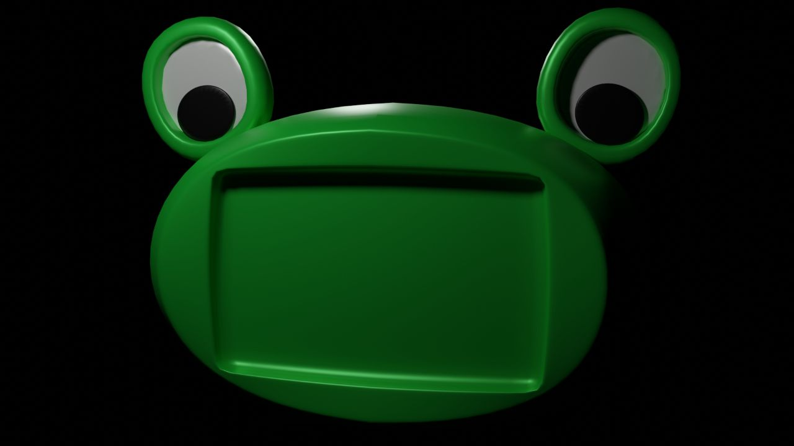
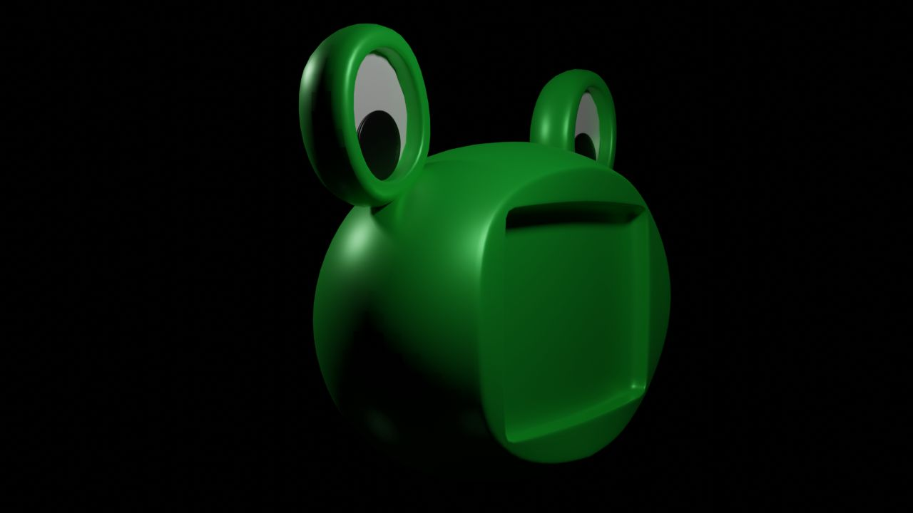
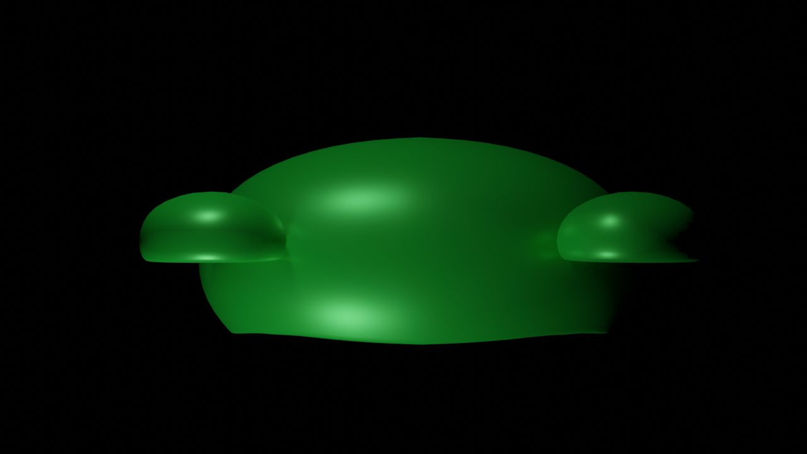
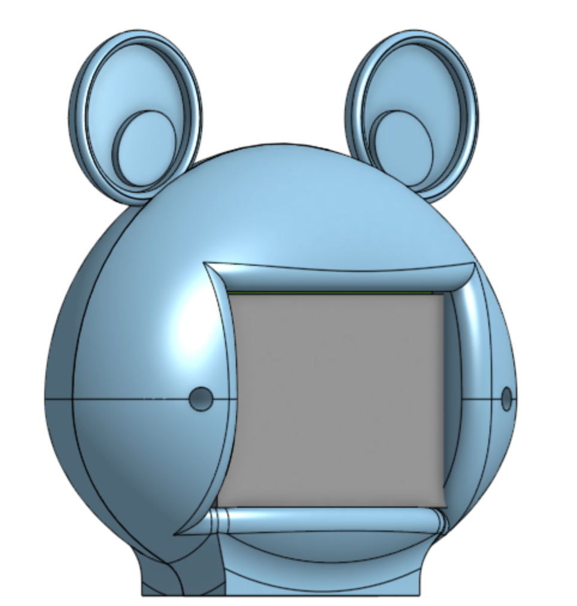
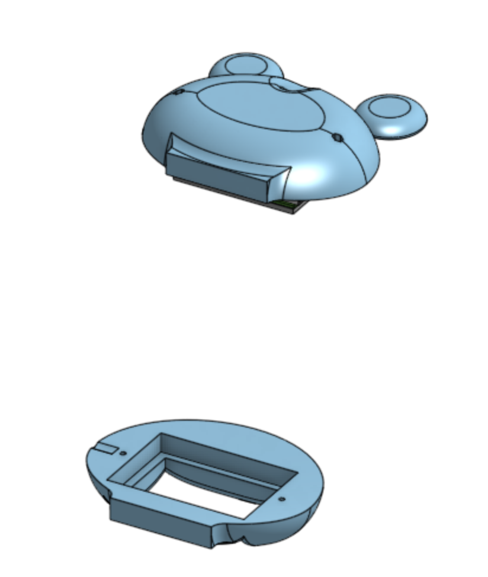
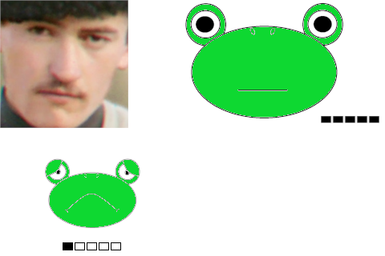
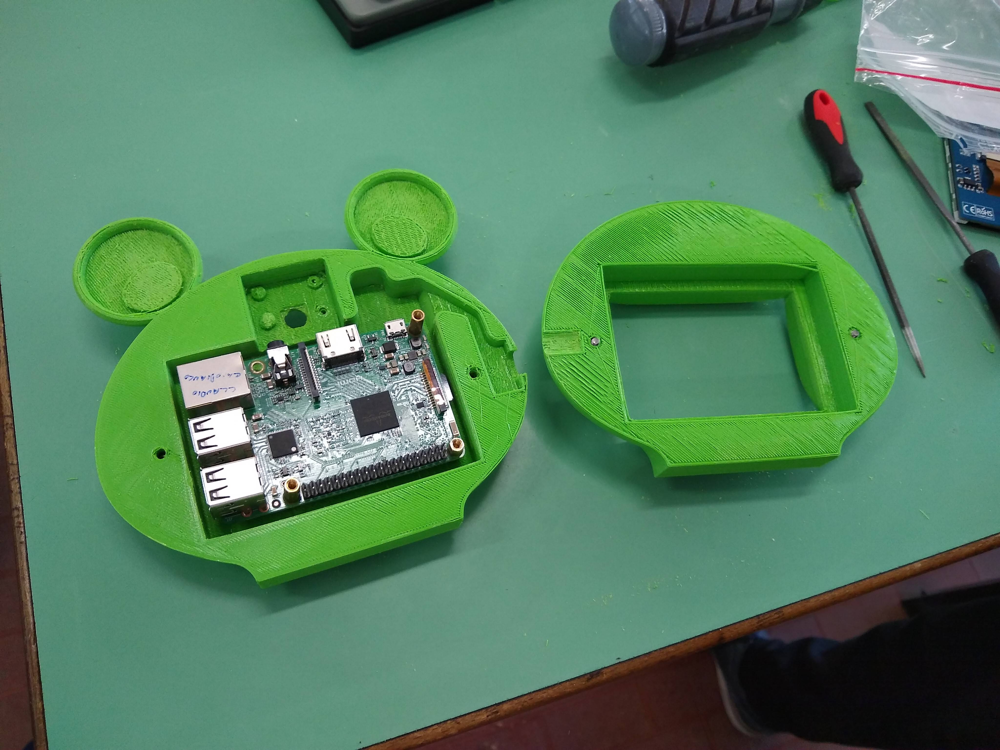
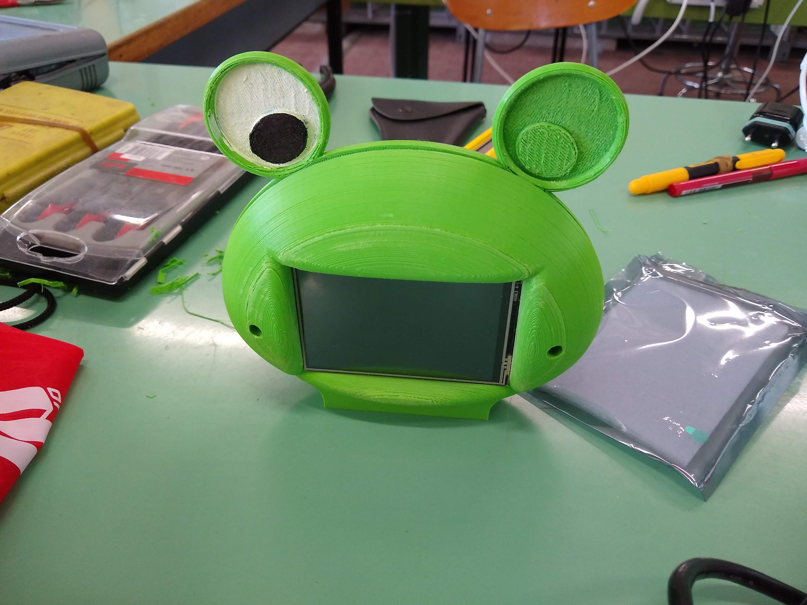

# Brief
We propose a technology to facilitate learning of social skills and educational activities for both verbal and non-verbal language in order to help people with communication difficulties.
Our proposed technology is composed by a portable device, with a small color screen, a microphone, a speaker and two cameras, that act as a facilitator in the communication between a person with difficulties and other people. The device “listen to” the conversation between these people and figure out their emotional state. If their emotional state diverges, probably due to a misunderstanding of emotional states, the device enters into action trying to help the conversation and resolve the misunderstanding.

# Prototype
## Rationale
We propose two shapes to target different audience. Both shapes of the device have been designed for young users. The goal is to help the user to perceive a possible misunderstanding through a "friendly-funny looking" device.

**FROG**: it addresses the younger age target, that are children aged between 4 to 8 years old. The choice of this subject is due to the fact that his funny looking and it may be accepted easily between males and females.

**IDK**: is aimed at the "elder" age range of the target audience, that the children aged between 8 to 11 years old. Its shape has been designed to be more anonymous in order to avoid embarrassment in the subject with communication difficulties despite having a playful apperance; besides the character’s “arms” act like a handle which allow a better portability even when the device is not in use. (this device will be prototyped in the future)

We choose to start prototyping the first device. The second device may be developed in the future.

## 3D model

### Preliminary design in Blender
We started with a rapid prototyping in Blender.

Then we add a bit of fancy rendering to give a better idea.

### 3D printing with OnShape
We moved to OnShape with [this document](https://cad.onshape.com/documents/ded5cd1085c5bb8ff9e7e6cc/w/644fef826693f4685b90f142/e/fb1e60ce61066c179cc7cb91) to prepare the file for 3D printing.

## User Interface
Here a proposal for the user interface.

The idea is to show the most likely expression on the top, close to the crop of the snapshot from the camera. In the lower part, there are other faces in order of emotion probability, as received from Azure Cognitive Services.

## Printed model
Almost there!

